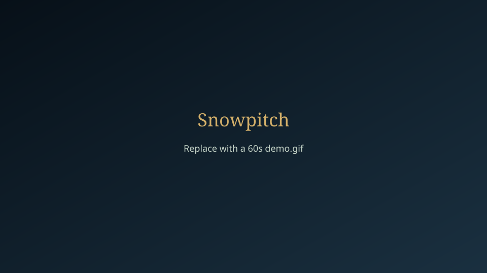
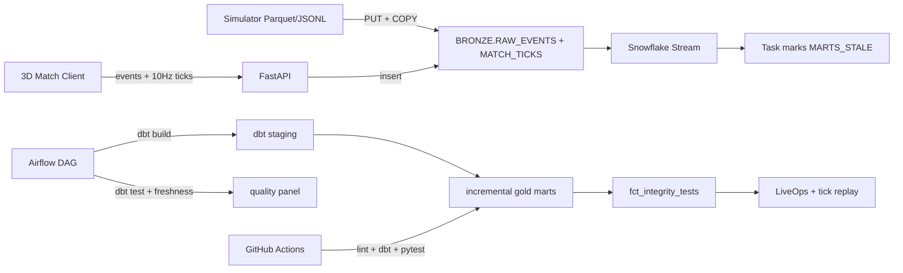

# Snowpitch

**Playable Whiteout weekend + a Snowflake/dbt warehouse that proves whether the live game is fair.**



> Storyboard: [`docs/screenshots/demo.gif.svg`](docs/screenshots/demo.gif.svg) — incident queue → evidence SQL → Match → Replay. Capture a real `demo.gif` with the steps in [`docs/screenshots/README.md`](docs/screenshots/README.md).

## The problem

Generic student DAU dashboards do not look like EA Data & Insights work. After a live-service patch, the real questions are:

1. Did matchmaking / finishing tilt?
2. Did advertised pack odds drift?
3. Is the transfer market being washed?
4. Are clients reporting physically impossible ball motion?

Snowpitch plants **four** integrity bugs in a sports economy, emits match + 10 Hz tick telemetry from a broadcast-style 3D client, and proves the warehouse can catch them with thresholds **and** two-proportion z-tests.

## Architecture



Python owns **bronze load only**. Every silver view and gold mart is defined once in [`dbt/`](dbt/) and run through [`warehouse/dbt_runner.py`](warehouse/dbt_runner.py).

| Layer | Owner | Contents |
|-------|--------|----------|
| Bronze | Python | `RAW_EVENTS` + **`MATCH_TICKS`** (separate table — see below) |
| Silver | dbt staging | players, matches, chances, goals, packs, trades, **match_ticks** |
| Gold | dbt marts | fairness, packs, market, spend, daily, ball physics, tick integrity, alerts, integrity_tests |

### Why ticks are a separate bronze table

A 90-minute match at 10 Hz is ~54k rows. Stuffing that into `RAW_EVENTS` as VARIANT would make every event staging model pay a parse tax on a 100× volume stream. `BRONZE.MATCH_TICKS` is clustered on `(MATCH_ID, TICK_MS)` and only the physics marts touch it.

## The four planted bugs (and what the warehouse found)

Demo seed (`make seed`) on DuckDB:

| Bug | Mechanism | Detection |
|-----|-----------|-----------|
| **Momentum** | After Whiteout, trailing sides finish late chances ~2× | Late conversion jumps; z-test + alert |
| **Pack nerf** | Advertised rare stays 12%; true rate drops to 5.5% | Observed rate collapses; chi-style alert |
| **Coin ring** | 8 accounts wash commons at ~9–14× median in &lt;120s | Wash share spike; critical alert |
| **Speed hack** | Small cohort teleports the ball 15–25 units in one tick | `fct_tick_integrity` + `/ops/replay` |

Detection thresholds live in `dbt/dbt_project.yml` vars (`max_plausible_ball_speed`, `teleport_displacement`, …) so alerts and singular tests cannot drift apart.

## Benchmark (demo profile)

| Metric | Value |
|--------|-------|
| Event rows | 63,949 |
| Tick rows | 105,300 (10% match sample × 180 ticks) |
| Event generate | ~1.9s |
| Bronze load | ~1.7s |
| dbt full build | ~5.0s |
| dbt rebuild | ~4.8s |

Large profile: `python -m simulator.generate --scale large` → ~5M events; `tick_sample_rate: 0.01`.

## Quick start

```bash
python3 -m venv ~/.venvs/snowpitch
~/.venvs/snowpitch/bin/pip install -r requirements.txt
cp .env.example .env
make assets        # CC0 HDRI + grass/snow PBR into apps/web/public/
make seed          # generate events+ticks + bronze + dbt build
make api           # http://localhost:8000/docs
cd apps/web && npm install && npm run dev   # http://localhost:3000
```

Useful targets: `make assets`, `make dbt`, `make dbt-test`, `make dbt-docs`, `make test`, `make lint`, `make benchmark`.

### Visual assets (CC0)

`make assets` downloads:

| Asset | Source | Licence |
|-------|--------|---------|
| `public/hdri/night.hdr` | Poly Haven *dikhololo_night* 1k | CC0 |
| `public/textures/grass/*` | ambientCG *Grass004* 1K | CC0 |
| `public/textures/snow/*` | ambientCG *Snow005* 1K | CC0 |

Binaries are gitignored. Optional Mixamo `player.glb` steps: [`apps/web/public/models/README.md`](apps/web/public/models/README.md).

### Snowflake trial

1. Sign up at https://signup.snowflake.com (warehouse product — not CoCo)
2. Fill `.env` (`SNOWFLAKE_*`, `WAREHOUSE_BACKEND=snowflake`)
3. `make seed-snowflake` then apply `transform/snowflake/04_stream_task.sql` and optionally `05_rbac.sql`

### Airflow (optional)

```bash
docker compose -f docker-compose.airflow.yml up
```

Open http://localhost:8080 (`admin` / `admin`). DAG: `snowpitch_daily`.

## 3D match (broadcast night stadium)

Night HDRI IBL, N8AO, ACES grade, ball-tracked DoF, SMAA; PBR turf with mow stripes / wear / snow mask and full pitch markings; jointed procedural players (or Mixamo GLB via `SkeletonUtils.clone`); netted goals, raked stands, GPU crowd wave, light shafts, layered snow, mist; quality tiers via `PerformanceMonitor`. Live matches flush 10 Hz ticks to `POST /play/ticks`. Flagged matches open in [`/ops/replay`](apps/web/app/ops/replay/page.tsx).

## What I would do differently at EA scale

- Replace Task dirty-flag with a Snowpark / external compute that runs dbt Cloud jobs on stream micro-batches
- Partition bronze by event date; cluster + Search Optimization on `PLAYER_ID`; keep ticks on a dedicated warehouse
- Great Expectations / Monte Carlo on freshness and alert volume SLOs
- Kafka (or Kinesis) in front of Snowpipe for client telemetry
- Looker / Tableau semantic layer on top of gold; this repo’s Recharts board is the sketch

## Stack checklist (EA Data Engineer postings)

Snowflake · dbt · Airflow · Python/SQL · GitHub Actions CI · Docker · data quality / freshness · BI dashboard · large event simulator · RBAC · Streams/Tasks · incremental marts · tick physics / anti-cheat forensics

## Tests

```bash
make test
```

DuckDB integrity tests always run. Snowflake smoke test runs when credentials are set. dbt singular integrity tests are configured to **warn** (the bugs are supposed to fire).
