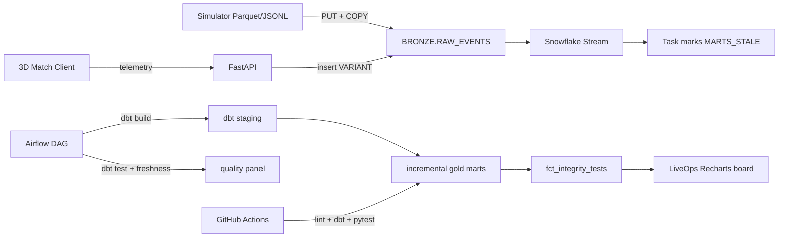

# Snowpitch

**Playable Whiteout weekend + a Snowflake/dbt warehouse that proves whether the live game is fair.**


> Replace with a 60s `docs/screenshots/demo.gif` (match → pack → LiveOps alerts). Reviewers decide in under two minutes whether to keep reading.

## The problem

Generic student DAU dashboards do not look like EA Data & Insights work. After a live-service patch, the real questions are:

1. Did matchmaking / finishing tilt?
2. Did advertised pack odds drift?
3. Is the transfer market being washed?

Snowpitch plants three integrity bugs in a sports economy, emits real match telemetry from a 3D client, and proves the warehouse can catch them with thresholds **and** two-proportion z-tests.

## Architecture



Python owns **bronze load only**. Every silver view and gold mart is defined once in [`dbt/`](dbt/) and run through [`warehouse/dbt_runner.py`](warehouse/dbt_runner.py). There is no second copy of transform SQL.

| Layer | Owner | Contents |
|-------|--------|----------|
| Bronze | Python (`snowflake_load`, live ingest) | `RAW_EVENTS` VARIANT / DuckDB `bronze_events` |
| Silver | dbt staging views | players, matches, chances, goals, packs, trades |
| Gold | dbt marts (incremental on Snowflake) | fairness, pack odds, market, spend, daily, alerts, **integrity_tests** |

Streams + Tasks mark marts stale when bronze changes; Airflow / `make dbt` / `POST /ops/refresh` run the incremental dbt build. Dynamic Tables would hide SQL from dbt and break the DuckDB CI path — see [`docs/ARCHITECTURE.md`](docs/ARCHITECTURE.md).

## The three planted bugs (and what the warehouse found)

Demo seed (`make seed`) on DuckDB — numbers from `data/benchmark.json` + `gold_integrity_tests`:

| Bug | Mechanism | Detection |
|-----|-----------|-----------|
| **Momentum** | After Whiteout, trailing sides finish late chances at 2.15× | Late conversion **21.7% → 49.2%**, z≈13.2, p≈1e-9, Wilson [46.2%, 52.3%] |
| **Pack nerf** | Advertised rare stays 12%; true rate drops to 5.5% | Observed **12.6% → 5.8%**, z≈−5.9, p≈6e-5, Wilson [4.6%, 7.2%] |
| **Coin ring** | 8 accounts wash commons at ~9–14× median in &lt;120s | Wash share **0% → 23.7%**, z≈13.1, p≈1e-9; alert fires at ≥20 wash trades |

Detection thresholds live in `dbt/dbt_project.yml` vars so alerts and singular tests cannot drift apart.

## Benchmark (demo profile)

| Metric | Value |
|--------|-------|
| Rows loaded | 63,996 |
| Event generate | ~1.1s |
| Bronze load (DuckDB) | ~1.5s |
| dbt full build | ~5.5s |
| dbt rebuild | ~6.0s |
| Snowflake credits | run `make seed-snowflake` then query `ACCOUNT_USAGE` (null on DuckDB) |

Large profile: `python -m simulator.generate --scale large` → ~5M events as chunked Parquet under `data/events_parquet/`.

## Quick start

```bash
python3 -m venv ~/.venvs/snowpitch
~/.venvs/snowpitch/bin/pip install -r requirements.txt
cp .env.example .env
make seed          # generate + bronze + dbt build
make api           # http://localhost:8000/docs
cd apps/web && npm install && npm run dev   # http://localhost:3000
```

Useful targets: `make dbt`, `make dbt-test`, `make dbt-docs`, `make test`, `make lint`, `make benchmark`.

### Snowflake trial

1. Sign up at https://signup.snowflake.com (warehouse product — not CoCo)
2. Fill `.env` (`SNOWFLAKE_*`, `WAREHOUSE_BACKEND=snowflake`)
3. `make seed-snowflake` then apply `transform/snowflake/04_stream_task.sql` and optionally `05_rbac.sql`

### Airflow (optional)

```bash
docker compose -f docker-compose.airflow.yml up
```

Open http://localhost:8080 (`admin` / `admin`). DAG: `snowpitch_daily`.

## 3D match (why it is not just capsules)

Night Whiteout pitch: snow storm, accumulating snow on a mown-stripe shader, volumetric floodlights, instanced crowd, ball trail, bloom / DoF / vignette, broadcast camera with goal cuts and replay orbits. When momentum is on and you trail past 70′, the timing window **widens on screen** and the vignette burns red — the client demonstrates the same bias `gold_integrity_alerts` pages on.

## What I would do differently at EA scale

- Replace Task dirty-flag with a Snowpark / external compute that runs dbt Cloud jobs on stream micro-batches
- Partition bronze by event date; cluster + Search Optimization on `PLAYER_ID`
- Great Expectations / Monte Carlo on freshness and alert volume SLOs
- Kafka (or Kinesis) in front of Snowpipe for client telemetry
- Looker / Tableau semantic layer on top of gold; this repo’s Recharts board is the sketch

## Stack checklist (EA Data Engineer postings)

Snowflake · dbt · Airflow · Python/SQL · GitHub Actions CI · Docker · data quality / freshness · BI dashboard · large event simulator · RBAC · Streams/Tasks · incremental marts

## Tests

```bash
make test
```

DuckDB integrity tests always run. Snowflake smoke test runs when credentials are set. dbt singular integrity tests are configured to **warn** (the bugs are supposed to fire).
